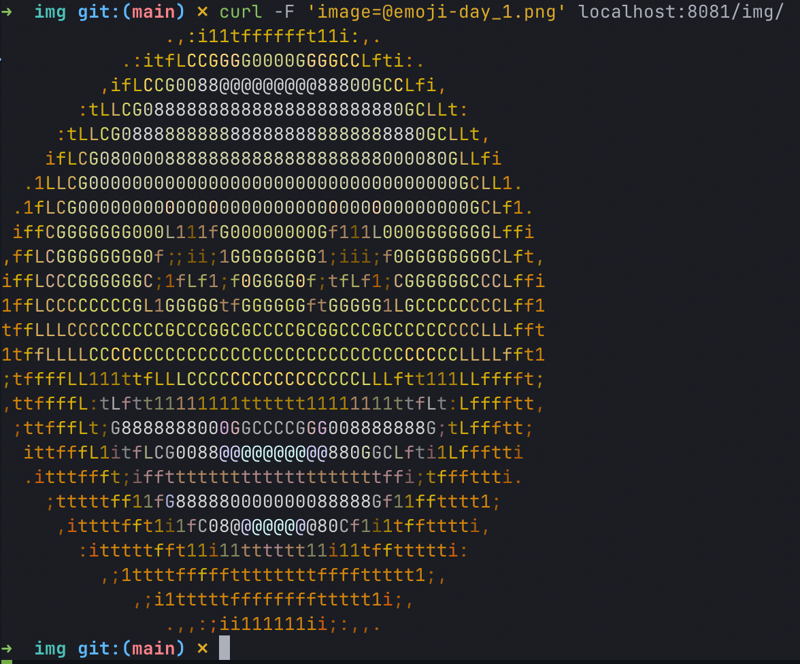

### Minimum Viable Product (MVP): 

`Main Goal`: To create a minimal functional product that can be brought to market and receive feedback from users. In our case, this is a demo of the application

`Documentation content`: MVP documentation should include more details compared to PoC. This usually includes a functional requirements definition, interface design, technical architecture, execution plan, test plan, scaling plan, and implementation strategy.

### Pre-requirements:

- ArgoCD is started 
- Repo for application `go-demo-app` added to ArgoCD 

### Check app functionality:

1. Clone asciiartity app 
   
```bash
git clone git@github.com:Aldans/go-demo-app.git
```
2. Change in `api-gateway` section port type to NodePort in `go-demo-app/helm/values.yaml`

```yaml
api-gateway:
  image:
    tag: 0.51.2
  service:
    type: NodePort
```
Add port-forward to app

```bash
k port-forward -n go-app svc/ambassador 8081:80
```

3. Run application

```bash
curl -F 'image=@emoji-day_1.png' localhost:8081/img/
```


4. App runned and working in k3d cluster 

```bash
➜  go-demo-app git:(main) ✗ k get all -n go-app

NAME                                  READY   STATUS    RESTARTS        AGE
pod/goapp-data-79749d9f96-zhfwj       1/1     Running   0               23h
pod/goapp-nats-box-78d56f5dd7-k2s5f   1/1     Running   0               23h
pod/goapp-front-984f8766f-4zs2v       1/1     Running   0               23h
pod/db-7968646c85-fr695               1/1     Running   0               23h
pod/cache-858575fc54-n57hl            1/1     Running   0               23h
pod/goapp-ascii-f7d947b4c-b6kdp       1/1     Running   0               23h
pod/goapp-api-6d654655f-jr9tv         1/1     Running   0               23h
pod/goapp-nats-0                      3/3     Running   0               23h
pod/goapp-img-57d9fc4494-jdm6h        1/1     Running   2 (3h3m ago)    23h
pod/ambassador-656769fddb-gfsb8       1/1     Running   18 (130m ago)   23h

NAME                       TYPE        CLUSTER-IP      EXTERNAL-IP   PORT(S)                                                 AGE
service/goapp-nats         ClusterIP   None            <none>        4222/TCP,6222/TCP,8222/TCP,7777/TCP,7422/TCP,7522/TCP   23h
service/db                 ClusterIP   10.43.200.40    <none>        3306/TCP                                                23h
service/goapp-front        ClusterIP   10.43.156.34    <none>        80/TCP                                                  23h
service/goapp-img          ClusterIP   10.43.253.32    <none>        80/TCP                                                  23h
service/goapp-ascii        ClusterIP   10.43.46.184    <none>        80/TCP                                                  23h
service/goapp-api          ClusterIP   10.43.228.219   <none>        80/TCP                                                  23h
service/goapp-data         ClusterIP   10.43.51.122    <none>        80/TCP                                                  23h
service/cache              ClusterIP   10.43.105.248   <none>        6379/TCP                                                23h
service/ambassador-admin   ClusterIP   10.43.102.241   <none>        8877/TCP                                                23h
service/ambassador         NodePort    10.43.129.135   <none>        80:30790/TCP                                            23h

NAME                             READY   UP-TO-DATE   AVAILABLE   AGE
deployment.apps/goapp-data       1/1     1            1           23h
deployment.apps/goapp-nats-box   1/1     1            1           23h
deployment.apps/goapp-front      1/1     1            1           23h
deployment.apps/db               1/1     1            1           23h
deployment.apps/cache            1/1     1            1           23h
deployment.apps/goapp-ascii      1/1     1            1           23h
deployment.apps/goapp-api        1/1     1            1           23h
deployment.apps/goapp-img        1/1     1            1           23h
deployment.apps/ambassador       1/1     1            1           23h

NAME                                        DESIRED   CURRENT   READY   AGE
replicaset.apps/goapp-data-79749d9f96       1         1         1       23h
replicaset.apps/goapp-nats-box-78d56f5dd7   1         1         1       23h
replicaset.apps/goapp-front-984f8766f       1         1         1       23h
replicaset.apps/db-7968646c85               1         1         1       23h
replicaset.apps/cache-858575fc54            1         1         1       23h
replicaset.apps/goapp-ascii-f7d947b4c       1         1         1       23h
replicaset.apps/goapp-api-6d654655f         1         1         1       23h
replicaset.apps/goapp-img-57d9fc4494        1         1         1       23h
replicaset.apps/ambassador-656769fddb       1         1         1       23h

NAME                          READY   AGE
statefulset.apps/goapp-nats   1/1     23h
```

5. Configuration ArgoCD for auto-sync for the repo with application `go-demo-app`

Add port-forward to ArgoCD

```bash
k port-forward -n argocd svc/argocd-server 8080:443
```


