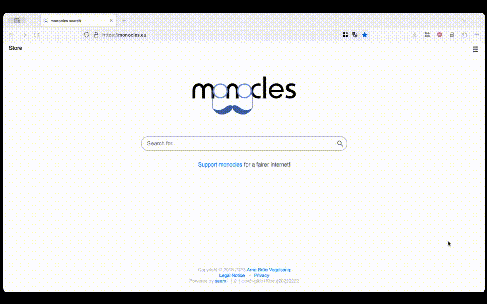

#### PoC - Proof of Concept. ArgoCD

`Main Goal:` Prove the technical or conceptual viability of the idea and concept of using ArgoCD as a CD tool. Prove that it is technically possible to realize the idea.

At this stage, the documentation may include a description of the concept, analysis of technical capabilities, definition of the selected technology stack, a short execution plan, technical scenarios, and PoC success metrics.

ArgoCD is a Kubernetes controller that continuously monitors running applications and compares the current state with the desired state. Deployments whose current state differs from the target state are considered out of sync. ArgoCD informs and visualizes the differences, providing options for automatic or manual synchronization of the desired state.

#### Setup Environment  

- Virtual Machine: "Debian GNU/Linux 11 (bullseye)" 
    - Installed Docker version 24.0.7, build afdd53b
    - k3d version v5.6.0 | k3s version v1.27.4-k3s1 (default)

1. Create and check k3d cluster 

   ```bash
   $ k3d cluster create argo --network host
   ...
   Cluster 'argo' created successfully!
       
   $ k get nodes -o wide
       
   NAME                STATUS   ROLES                  AGE   VERSION        INTERNAL-IP    EXTERNAL-IP   OS-IMAGE   KERNEL-VERSION    CONTAINER-RUNTIME
   k3d-argo-server-0   Ready    control-plane,master   79m   v1.27.4+k3s1   192.168.33.7   <none>        K3s dev    5.10.0-21-arm64   containerd://1.7.1-k3s1
    ```
2. Install ArgoCD

   ```bash
   $ kubectl create namespace argo
   namespace/argo created

   $ kubectl apply -f https://raw.githubusercontent.com/argoproj/argo-cd/stable/manifests/install.yaml
   ```

3. Change svc tupe to NodePort for ArgoCD 

   ```bash
   $ k patch svc argocd-server -n argo -p '{"spec": {"type": "NodePort"}}'
   service/argocd-server patched

   $ k get -n argo svc/argocd-server
   NAME            TYPE       CLUSTER-IP     EXTERNAL-IP   PORT(S)                      
   argocd-server   NodePort   10.43.213.90   <none>        80:32242/TCP,443:30096/TCP   
   ```
4. Get password for login to ArgoCD

   ```bash
   $ k -n argo get secret argocd-initial-admin-secret -o jsonpath="{.data.password}" | base64 -d
   ```
5. Open ArgoCD in browser and login.
    
   


